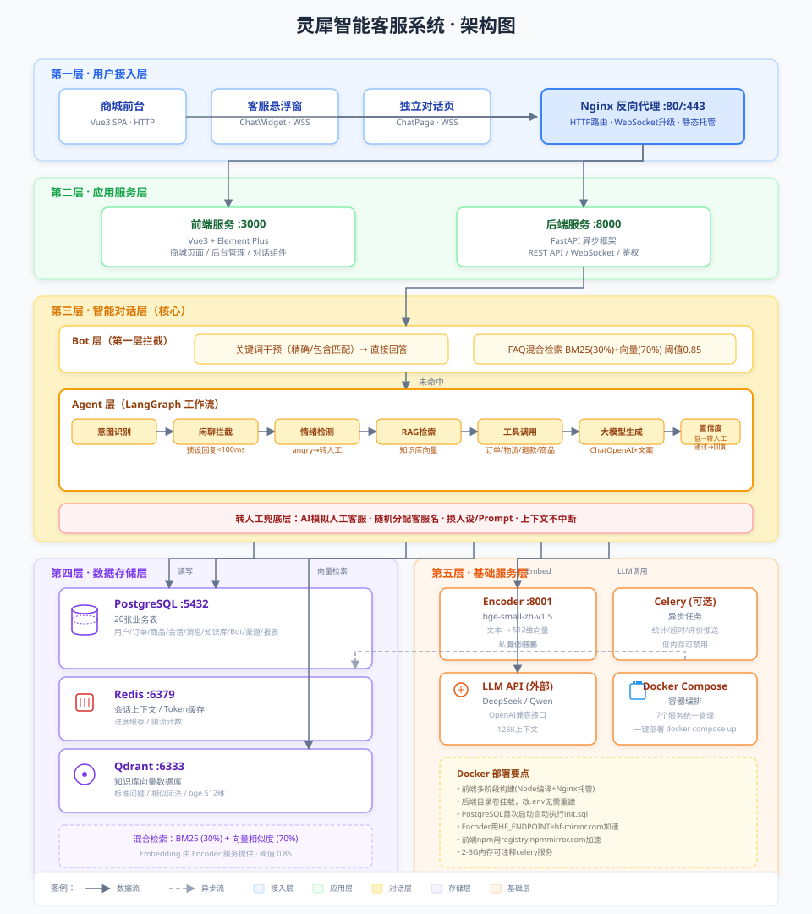
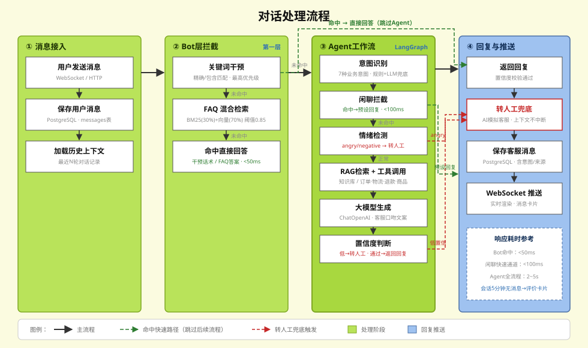
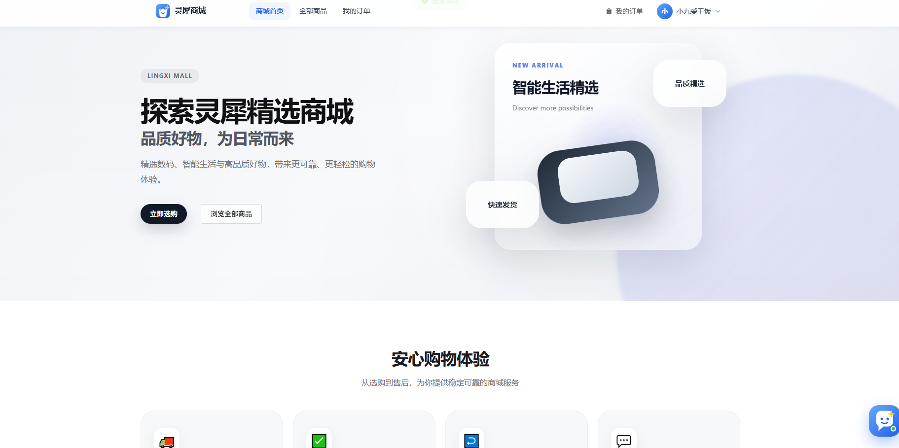
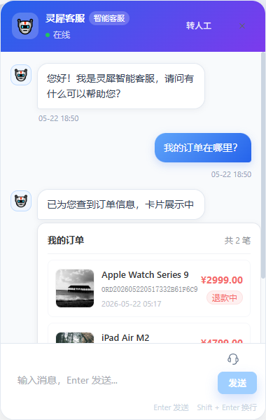
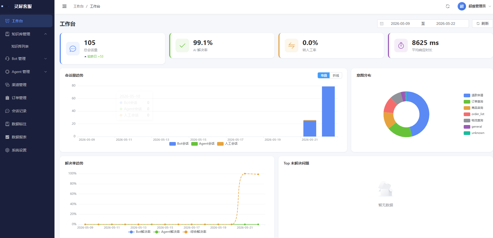
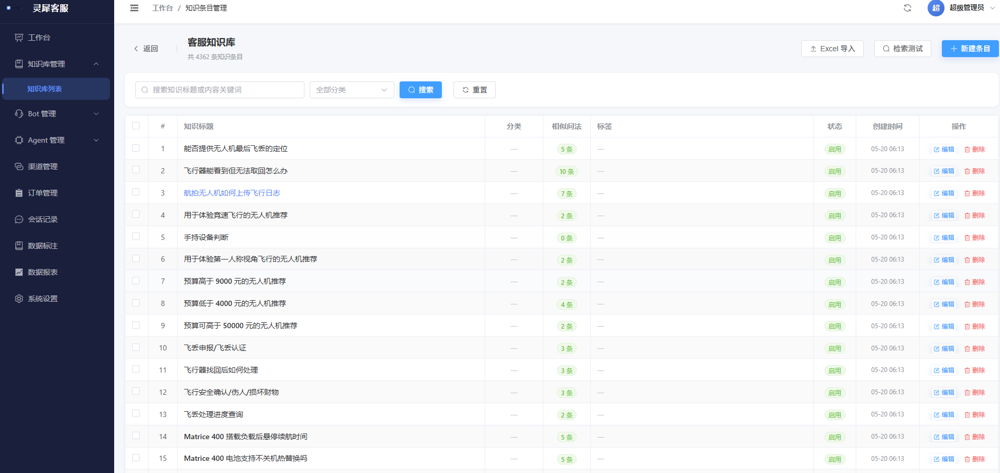

<p align="center">
  
</p>

<h1 align="center">灵犀智能客服系统</h1>

<p align="center">
  <strong>Bot + Agent 双层拦截 · 显著提升 AI 解决率</strong>
</p>

<p align="center">
  
  
  
  
  
  
</p>

<p align="center">
  电商场景智能客服，通过 Bot（FAQ知识库）与 Agent（大模型工作流）双层拦截机制，<br>
  将常见问题自动拦截、复杂问题智能处理、兜底问题平滑转人工，有效提升 AI 解决率。
</p>

---

## 🏗️ 系统架构

系统采用五层架构，架构总览如下图：



### 对话处理流程



---

## ✨ 核心特性

### 🛡️ Bot + Agent 双层拦截

```
用户提问 → Bot层（关键词干预 / FAQ检索）→ 匹配 → 直接回答
                                     → 未匹配 → Agent层（意图识别 / 情绪检测 / 工具调用 / 大模型生成）→ 回答
                                     → 兜底 → 转人工客服（AI模拟，换人设和Prompt）
```

- **第一层 Bot**：关键词干预（最高优先级）+ BM25/Embedding 混合检索（阈值 0.85 可配）
- **第二层 Agent**：LangGraph 工作流驱动，7种意图识别 + 情绪检测 + RAG 检索 + 工具调用
- **兜底层**：自动/主动转人工，AI模拟人工客服换人设回答，同一会话上下文不中断

### � 闲聊快速通道

- 用户发送"你好""谢谢""再见"等闲聊消息时，**规则匹配直接返回预设回复**，跳过 LLM 调用
- 响应时间 < 100ms，避免模型兜底出现"非常抱歉，我暂时无法回答"的尴尬场景
- 支持 greeting / thanks / bye / identity 四种子类型，每类 3-4 个随机回复变体

### 🔄 会话持久化

- 刷新页面 / 重进聊天窗口，**历史对话自动加载**，不再每次开新会话
- `conversation_id` 存入 localStorage（按用户维度区分），WebSocket 连接时携带复用已有会话
- 后端新增公开历史消息接口，按 `user_id` 校验归属，无需登录 Token

### � 混合检索技术

- **BM25（权重 0.3）** + **向量相似度（权重 0.7）** 混合检索
- Embedding 模型：**bge-small-zh-v1.5**（私有化部署，512维）
- 向量数据库：**Qdrant**，标准问题 + 相似问法全部向量化
- 相似度阈值可配置，默认 0.85

### 🤖 Agent 工作流（LangGraph）

```
意图识别 → 闲聊拦截 → 情绪检测 → RAG检索 → 工具调用 → 生成回答 → 置信度判断
              ↓
         直接返回预设回复（跳过后续流程）
```

- **7种意图**：订单查询 / 物流查询 / 退款申请 / 商品咨询 / 售后咨询 / 投诉 / 一般咨询
- **闲聊意图**：命中关键词直接返回，响应 < 100ms
- **情绪检测**：neutral / negative / angry，触发自动转人工
- **置信度判断**：低置信度自动降级，避免错误回答

### 🔧 工具调用能力

Agent 可调用4种工具获取真实数据，工具成功/失败均返回**客服口吻文案**：

| 工具 | 说明 | 数据来源 |
|------|------|----------|
| 查询订单 | 根据订单号/用户ID查询订单详情 | 电商前台真实订单数据 |
| 查询物流 | 查看物流状态和轨迹 | Mock物流数据 |
| 发起退款 | 提交退款申请，修改订单状态 | 真实修改订单状态 |
| 查询商品 | 搜索商品信息 | 电商前台商品数据 |

---

## 📸 页面截图

> 截图待补充，请将图片放入 `docs/images/` 目录

<table>
  <tr>
    <td><strong>商城首页</strong></td>
    <td><strong>客服对话窗口</strong></td>
  </tr>
  <tr>
    <td></td>
    <td></td>
  </tr>
  <tr>
    <td><strong>后台工作台</strong></td>
    <td><strong>知识库管理</strong></td>
  </tr>
  <tr>
    <td></td>
    <td></td>
  </tr>
</table>

---

## 🛠️ 技术栈

| 层级 | 技术 | 说明 |
|------|------|------|
| **后端框架** | FastAPI | Python 异步，适合高并发 |
| **Agent框架** | LangGraph | 工作流编排，支持条件分支和循环 |
| **Embedding** | bge-small-zh-v1.5 | 私有化部署，512维向量 |
| **向量数据库** | Qdrant | 高性能向量检索 |
| **关系数据库** | PostgreSQL 15 | 20张业务表 |
| **缓存** | Redis 7 | 会话上下文 / Token存储 / 进度缓存 |
| **异步任务** | Celery + Beat | 导入索引重建 / 定时统计 / 会话超时 |
| **大模型** | DeepSeek / Qwen | 私有化API，128K上下文 |
| **前端框架** | Vue 3 + Vite | Composition API |
| **UI库** | Element Plus | 后台管理页面 |
| **图表** | ECharts | 数据报表可视化 |
| **状态管理** | Pinia | 用户/购物车/对话状态 |
| **部署** | Docker Compose + Nginx | 容器化私有化部署 |

---

## 🚀 快速开始

### 环境要求

| 依赖 | 版本 | 说明 |
|------|------|------|
| Python | 3.11+ | 后端运行环境 |
| Node.js | 20+ | 前端运行环境 |
| PostgreSQL | 15+ | 关系数据库 |
| Redis | 7+ | 缓存服务 |
| Qdrant | latest | 向量数据库 |

### 方式一：Docker 部署（推荐）

```bash
# 克隆项目
git clone https://github.com/Andyzrp/lingxi-support-ai.git
cd lingxi-support-ai

# 配置环境变量
cp .env.example .env
# 编辑 .env 填写数据库、Redis、Qdrant、大模型API等配置

# 一键启动所有服务（自动构建镜像 + 初始化数据库）
docker compose up -d --build

# 查看服务状态
docker compose ps

# 访问页面
# 前台商城：http://localhost:3000
# 后台管理：http://localhost:3000/admin
# 后端接口文档：http://localhost:8000/docs
```

**Docker 部署说明：**

- 共 7 个服务：`postgres` / `redis` / `qdrant` / `encoder` / `backend` / `celery` / `frontend`
- 前端 Dockerfile 采用多阶段构建（Node.js 编译 + Nginx 托管静态资源）
- 后端目录通过数据卷挂载，修改 `.env` 后 `docker compose restart backend` 即可生效，无需重新构建
- PostgreSQL 首次启动自动执行 `sql/init.sql` 初始化表结构
- Encoder 服务预下载 `bge-small-zh-v1.5` 模型，使用 `HF_ENDPOINT=hf-mirror.com` 加速
- 前端 npm 使用 `registry.npmmirror.com` 加速依赖安装
- 低内存服务器（2-3G）可注释掉 `celery` 服务（代码中无 `.delay()` 调用）

### 方式二：本地开发

**后端**

```bash
cd backend

# 安装依赖
pip install -r requirements.txt

# 配置环境变量
cp ../.env.example .env
# 编辑 .env 填写必要配置

# 启动后端
uvicorn app.main:app --reload --host 0.0.0.0 --port 8000

# 启动 Celery Worker（异步任务）
celery -A app.core.celery_app worker --loglevel=info --pool=solo

# 启动 Celery Beat（定时任务调度）
celery -A app.core.celery_app beat --loglevel=info
```

**前端**

```bash
cd frontend

# 安装依赖
npm install

# 启动开发服务器
npm run dev
```

**Embedding 服务（可选）**

```bash
cd encoder

# Docker 部署
docker build -t lingxi-encoder .
docker run -d --name lingxi_encoder -p 8001:8001 lingxi-encoder
```

---

## 📁 项目结构

```
lingxi-support-ai/
├── backend/
│   ├── app/
│   │   ├── api/v1/          # API路由
│   │   ├── agent/           # LangGraph Agent工作流
│   │   │   ├── graph.py     # 工作流编排
│   │   │   ├── state.py     # 状态定义
│   │   │   ├── nodes/       # 意图识别/情绪检测/RAG/工具/生成/置信度/闲聊拦截
│   │   │   └── tools/       # 订单/物流/退款/商品查询
│   │   ├── crud/            # 数据库CRUD操作
│   │   ├── models/          # SQLAlchemy数据模型（20张表）
│   │   ├── schemas/         # Pydantic请求/响应模型
│   │   ├── services/        # 业务逻辑（对话/Bot检索/知识导入/向量化）
│   │   ├── tasks/           # Celery异步任务（统计/会话超时/评价推送）
│   │   ├── core/            # 基础设施（数据库/Redis/Qdrant/安全/Celery配置）
│   │   └── config.py        # 项目配置
│   └── main.py              # 应用入口
├── frontend/
│   ├── src/
│   │   ├── api/             # HTTP请求层
│   │   ├── components/chat/ # 客服对话组件（窗口/消息/输入/卡片/评价）
│   │   ├── stores/          # Pinia状态管理（user/chat/cart/admin）
│   │   ├── views/
│   │   │   ├── mall/        # 商城页面（首页/商品/订单）
│   │   │   ├── admin/       # 后台管理（Dashboard/知识库/Bot/Agent/渠道/报表/标注/设置）
│   │   │   └── chat/        # 独立对话页（渠道接入）
│   │   └── router/          # 路由配置 + 守卫
│   └── package.json
├── encoder/                 # bge-small-zh Embedding编码服务
├── nginx/                   # Nginx配置
├── sql/init.sql             # 数据库初始化脚本（20张表）
├── docker-compose.yml       # Docker服务编排
└── .env.example             # 环境变量模板
```

---

## 📋 功能模块

### 商城前台

- 用户注册 / 登录
- 商品列表 + 详情 + 模拟下单
- 订单查询 + 物流查看
- 客服悬浮按钮入口

### 智能客服对话

- **Bot层**：关键词干预（精确/包含匹配，触发话术/推荐FAQ/转人工）+ FAQ混合检索
- **Agent层**：意图识别 → 闲聊拦截 → 情绪检测 → RAG检索 → 工具调用 → 大模型生成 → 置信度判断
- **闲聊快速通道**：打招呼/答谢等场景直接返回预设回复，跳过 LLM 调用，响应 < 100ms
- **转人工**：AI模拟人工客服，随机分配客服名称，同一会话上下文不中断
- **卡片回复**：订单/物流/商品等信息以卡片形式展示，支持直接操作
- **会话持久化**：刷新页面/重进聊天窗口自动加载历史对话，`conversation_id` 存 localStorage
- **工具文案优化**：工具成功/失败均返回客服口吻友好文案，不暴露技术细节
- **会话生命周期**：5分钟无消息 → 推送评价卡片 → 会话结束

### 后台管理平台

| 模块 | 功能 |
|------|------|
| 工作台 | 核心指标卡片 + 会话量/解决率趋势图 + 意图分布饼图 |
| 知识库 | 多知识库管理 / Excel批量导入（分批+进度） / 单条CRUD / 检索效果测试 |
| Bot管理 | 匹配阈值 / 关键词干预 / 自动转人工配置 |
| Agent管理 | 系统Prompt / 人工Prompt / 模型参数 / 工具开关 / 版本管理+发布 |
| 渠道管理 | 测试/正式渠道 / 内容配置（热点问题/Banner/快捷标签）/ 发布（独立页/iframe/JS挂件） |
| 会话记录 | 实时监控 / 历史查询 / 对话详情 |
| 数据标注 | 好回答沉淀知识库 / 差回答标记优化 |
| 数据报表 | 会话量趋势 / 解决率 / 转人工率 / 满意度 / Top未解决 / 意图分布 |
| 系统设置 | 情绪关键词 / 投诉词库 / 超时时间 / 商品管理 |

---

## ⚙️ 配置说明

主要配置项通过 `.env` 文件管理：

```bash
# 数据库
POSTGRES_HOST=postgres       # Docker内部使用服务名
POSTGRES_PORT=5432
POSTGRES_DB=lingxi_support
POSTGRES_USER=lingxi
POSTGRES_PASSWORD=your_password

# Redis
REDIS_HOST=redis
REDIS_PORT=6379

# Qdrant
QDRANT_HOST=qdrant
QDRANT_PORT=6333

# 大模型API（支持 DeepSeek / Qwen 等OpenAI兼容接口）
LLM_BASE_URL=https://api.deepseek.com/v1
LLM_API_KEY=your_api_key
LLM_MODEL=deepseek-chat

# Embedding服务
EMBEDDING_HOST=encoder       # Docker内部使用服务名
EMBEDDING_PORT=8001

# JWT安全
SECRET_KEY=your_secret_key  # 生产环境务必修改！
```

> **提示**：Docker 部署时 `HOST` 使用服务名（如 `postgres`/`redis`/`qdrant`/`encoder`），本地开发时改为 `localhost` 或实际IP。

---

## 🔑 默认账号

| 角色 | 账号 | 密码 | 入口 |
|------|------|------|------|
| 管理员 | admin | admin123456 | http://localhost:3000/admin/login |
| 商城用户 | 自行注册 | 自定义 | http://localhost:3000/login |

---

## 📊 开发进度

| 模块 | 完成度 | 状态 |
|------|--------|------|
| 后端基础设施 | 100% | ✅ 完成 |
| 后端全部接口 | 100% | ✅ 完成 |
| Agent工作流 | 100% | ✅ 完成 |
| 闲聊快速通道 | 100% | ✅ 完成 |
| 会话持久化（历史对话加载） | 100% | ✅ 完成 |
| 工具回复客服文案优化 | 100% | ✅ 完成 |
| 前台商城页面 | 100% | ✅ 完成 |
| 客服对话组件 | 100% | ✅ 完成 |
| 后台管理平台 | 100% | ✅ 完成 |
| Docker部署 | 100% | ✅ 完成 |
| widget.js挂件 | 0% | ⬜ 待开发 |
| LangChain记忆功能 | 0% | ⬜ 规划中 |
| 知识库数据导入 | 5% | ⬜ 进行中 |

---

## 📌 渠道接入方式

| 方式 | 代码 | 适用场景 |
|------|------|----------|
| 独立页面 | `http://domain/chat?channel={token}&user_id={uid}` | 微信/邮件/二维码分发 |
| iframe嵌入 | `<iframe src="http://domain/chat?channel={token}" width="380" height="600" />` | 官网嵌入客服窗口 |
| JS挂件 | `<script src="http://domain/widget.js" data-channel="{token}" />` | 一行代码接入（待开发） |

---

## 🤝 参与贡献

1. Fork 本仓库
2. 新建分支：`git checkout -b feature/xxx`
3. 提交修改：`git commit -m 'feat: xxx'`
4. 推送分支：`git push origin feature/xxx`
5. 提交 Pull Request

---

## 📄 License

[MIT License](LICENSE)
